# Entity-Relationship Diagram

The schema is **multi-tenant by tournament**. Tables fall into two scopes:

- **Global tables** (no `tournament_id`): `confederation`, `team`, `player`,
  `referee`, `stadium`, `league`, `club`. These represent entities whose
  identity is independent of any single edition (Argentina the national team;
  Lusail Stadium; Messi the player).
- **Tournament-scoped tables** (carry `tournament_id` directly):
  `tournament_team`, `tournament_group`, `group_standing`, `coach`,
  `squad_player`, `match`, `match_official`, `match_lineup`, `match_event`,
  `penalty_kick`. Every row is unambiguously associated with one edition.

`tournament_id` is **denormalized** onto every per-tournament row rather than
reached only through parent FKs. This is the standard multi-tenant pattern in
production PostgreSQL: faster filtering, simpler queries
(`WHERE tournament_id = ?`), composite uniqueness becomes natural
(`(tournament_id, match_number)`), and it leaves the door open for row-level
security policies later.

This diagram evolves per phase. As Phases 2–6 add tables, the diagram is
regenerated to reflect the latest merged state.

```mermaid

%%{init: {
  "theme": "default",
  "themeVariables": {
    "fontFamily": "Fira Code, Consolas, monospace",
    "textColor": "#555",
    "lineColor": "#555"
  }
}}%%

erDiagram
    tournament {
        smallint id PK
        smallint year UK
        varchar host_country
        varchar edition_name
        date start_date
        date end_date
        smallint winner_team_id FK
    }

    confederation {
        smallint id PK
        varchar name
        varchar code UK
    }

    team {
        smallint id PK
        varchar name UK
        varchar code UK
        smallint confederation_id FK
    }

    tournament_team {
        smallint id PK
        smallint tournament_id FK
        smallint team_id FK
        smallint fifa_ranking
        smallint final_position
    }

    tournament_group {
        smallint id PK
        smallint tournament_id FK
        char letter
    }

    group_standing {
        smallint id PK
        smallint tournament_id FK
        smallint group_id FK
        smallint team_id FK
        smallint played
        smallint won
        smallint drawn
        smallint lost
        smallint goals_for
        smallint goals_against
        smallint goal_difference
        smallint points
        smallint position
    }

    stadium {
        smallint id PK
        varchar name
        varchar city
        varchar country
        integer capacity
        smallint opened_year
        text description
    }

    league {
        smallint id PK
        varchar name
        varchar country
        smallint tier
    }

    club {
        smallint id PK
        varchar name
        varchar country
        smallint league_id FK
    }

    player {
        smallint id PK
        varchar first_name
        varchar last_name
        varchar known_name
        date date_of_birth
        varchar nationality
        player_position position
    }

    squad_player {
        smallint id PK
        smallint tournament_id FK
        smallint team_id FK
        smallint player_id FK
        smallint club_id FK
        smallint shirt_number
        player_position position
    }

    coach {
        smallint id PK
        smallint tournament_id FK
        smallint team_id FK
        varchar first_name
        varchar last_name
        varchar nationality
    }

    referee {
        smallint id PK
        varchar first_name
        varchar last_name
        varchar nationality
        smallint confederation_id FK
    }

    match {
        smallint id PK
        smallint tournament_id FK
        smallint match_number
        match_stage stage
        date match_date
        time kickoff_time
        smallint stadium_id FK
        smallint home_team_id FK
        smallint away_team_id FK
        smallint home_score
        smallint away_score
        smallint home_score_ht
        smallint away_score_ht
        boolean extra_time
        boolean penalty_shootout
        integer attendance
        smallint group_id FK
    }

    match_official {
        smallint id PK
        smallint tournament_id FK
        smallint match_id FK
        smallint referee_id FK
        official_role role
    }

    match_lineup {
        smallint id PK
        smallint tournament_id FK
        smallint match_id FK
        smallint team_id FK
        smallint player_id FK
        boolean is_starter
        smallint shirt_number
        player_position position
    }

    match_event {
        smallint id PK
        smallint tournament_id FK
        smallint match_id FK
        smallint team_id FK
        smallint player_id FK
        event_type event_type
        smallint minute
        smallint stoppage_minute
        smallint secondary_player_id FK
        varchar detail
    }

    penalty_kick {
        smallint id PK
        smallint tournament_id FK
        smallint match_id FK
        smallint team_id FK
        smallint player_id FK
        smallint kick_order
        boolean scored
    }

    tournament ||--o{ tournament_team : "includes"
    tournament ||--o{ tournament_group : "organises"
    tournament ||--o{ group_standing : "scopes"
    tournament ||--o{ coach : "scopes"
    tournament ||--o{ squad_player : "scopes"
    tournament ||--o{ match : "scopes"
    tournament ||--o{ match_official : "scopes"
    tournament ||--o{ match_lineup : "scopes"
    tournament ||--o{ match_event : "scopes"
    tournament ||--o{ penalty_kick : "scopes"
    tournament }o--|| team : "won by"

    confederation ||--o{ team : "has members"
    confederation ||--o{ referee : "registers"

    team ||--o{ tournament_team : "participates as"
    team ||--o{ squad_player : "registers"
    team ||--o{ coach : "employs"
    team ||--o{ group_standing : "has standing"
    team ||--o{ match : "plays as home"
    team ||--o{ match : "plays as away"
    team ||--o{ match_lineup : "fields"
    team ||--o{ match_event : "involved in"
    team ||--o{ penalty_kick : "takes"

    tournament_group ||--o{ group_standing : "contains"
    tournament_group ||--o{ match : "hosts"

    player ||--o{ squad_player : "registered as"
    player ||--o{ match_lineup : "appears in"
    player ||--o{ match_event : "primary actor"
    player ||--o{ match_event : "secondary actor"
    player ||--o{ penalty_kick : "takes"

    league ||--o{ club : "contains"
    club ||--o{ squad_player : "employs"

    stadium ||--o{ match : "hosts"

    match ||--o{ match_official : "officiated by"
    match ||--o{ match_lineup : "has lineup"
    match ||--o{ match_event : "has event"
    match ||--o{ penalty_kick : "has shootout"

    referee ||--o{ match_official : "assigned to"
```

